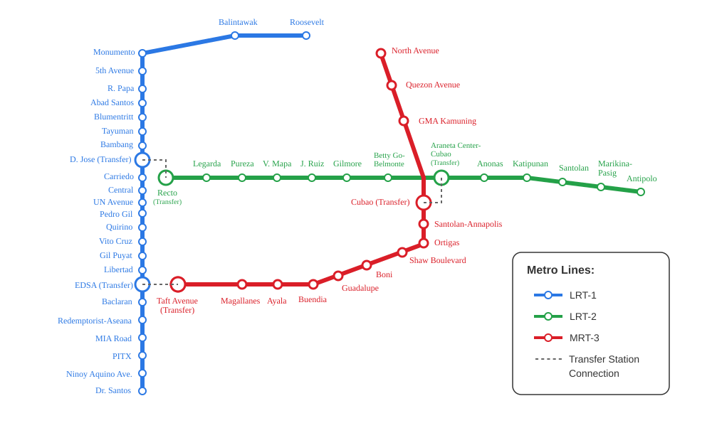

# Manila Metro Rail Transit Map 2024

A simple SVG map of Manila's metro rail transit system (LRT-1, LRT-2, and MRT-3) featuring:

- Color-coded lines (LRT-1, LRT-2, MRT-3)
- Station markers with names and interchange points
- Clean design with legend (1000x595 viewport)
- Fully customizable SVG code

  
Perfect for web embedding, documentation, or transit information displays.

## Preview
